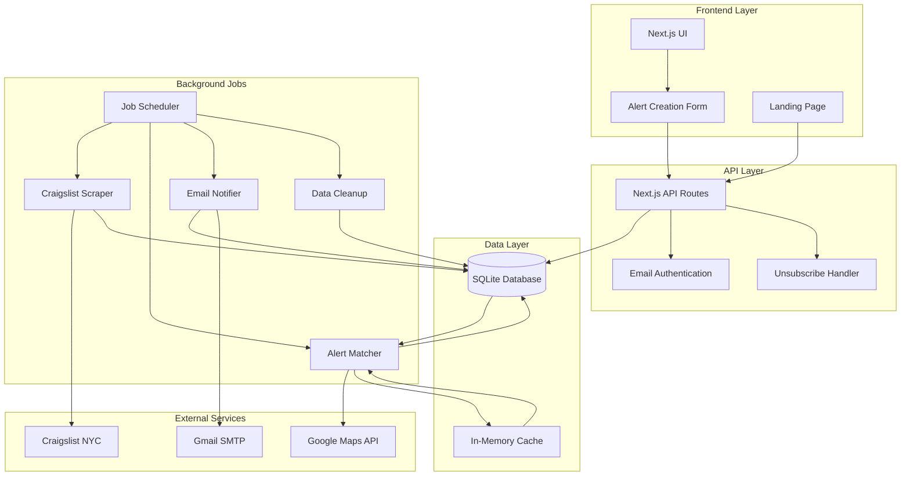
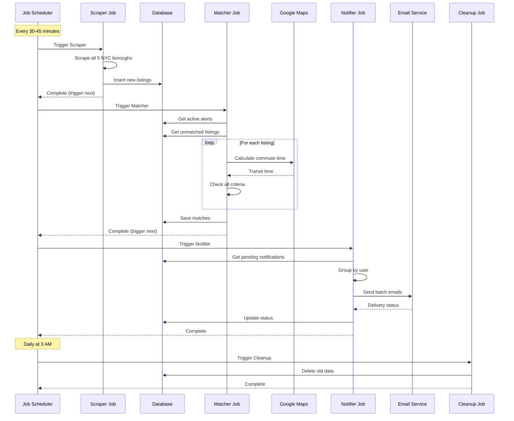
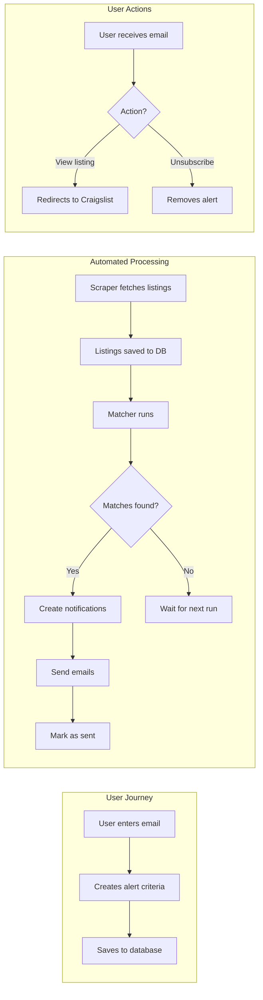

# Burroughs Alert

[](https://www.typescriptlang.org/)
[](https://nextjs.org/)
[](https://www.sqlite.org/)

A smart notification service for NYC apartment hunting. Get real-time alerts when apartments matching your criteria become available on Craigslist.

## 🚀 Project Overview

Burroughs Alert is an automated apartment hunting assistant that continuously monitors Craigslist NYC for new listings. When an apartment matches your saved criteria (price, bedrooms, neighborhoods, pet policy), you'll receive an instant email notification.

**MVP Status**: ✅ Complete with automated job system

## 🛠 Tech Stack

- **Frontend**: Next.js 15, TypeScript, Tailwind CSS, shadcn/ui
- **Backend**: Next.js API Routes, SQLite, Drizzle ORM
- **Scraping**: Puppeteer (headless browser automation)
- **Email**: Nodemailer with Gmail SMTP
- **Job System**: Custom background job pipeline
- **Testing**: Vitest, Testing Library
- **Code Quality**: ESLint, Prettier, TypeScript strict mode

## ✨ Features

### Implemented Features

- ✅ **Automated Scraping**: Puppeteer-based scraper for all 5 NYC boroughs
- ✅ **Smart Matching Engine**: Matches listings against user criteria (price, bedrooms, neighborhoods, pets)
- ✅ **Email Notifications**: Batch email system with HTML formatting and unsubscribe links
- ✅ **Background Job System**: Automated pipeline (Scraper → Matcher → Notifier → Cleanup)
- ✅ **Duplicate Prevention**: Never sends the same listing twice
- ✅ **Data Cleanup**: Automatic removal of old listings and notifications
- ✅ **Health Monitoring**: System health checks and status monitoring
- ✅ **Privacy First**: Email-only authentication, automatic data cleanup
- ✅ **Rich Data Extraction**: Captures neighborhoods, coordinates, pet policies, and more

### Coming Soon

- 🔄 **Commute Time Filtering**: Filter apartments by commute time to work/school
- 🔄 **Advanced Search Filters**: Square footage, amenities, move-in date

## 🏗 Architecture

### System Overview



### Job Pipeline Flow



### Data Flow Architecture



```
Simple Overview:
Frontend (Next.js) ↔ API Routes ↔ SQLite Database
                        ↓
               Background Job System
                        ↓
           [Scraper → Matcher → Notifier → Cleanup]
                        ↓
              External Services (SMTP, Maps)
```

### Job Pipeline

1. **Scraper Job** (30-45min intervals) - Fetches new Craigslist listings
2. **Matcher Job** (triggered after scraper) - Matches listings against alerts
3. **Notifier Job** (triggered after matcher) - Sends batch email notifications
4. **Cleanup Job** (daily) - Maintains database health
5. **Health Check** (5min intervals) - Monitors system status

## 📦 Setup Instructions

### Prerequisites

- Node.js 18+ and npm
- Gmail account with App Password for SMTP

### Installation

1. **Clone the repository**

   ```bash
   git clone https://github.com/yourusername/burroughs-alert.git
   cd burroughs-alert
   ```

2. **Install dependencies**

   ```bash
   npm install
   ```

3. **Set up environment variables**

   ```bash
   cp .env.example .env.local
   ```

4. **Configure `.env.local`**

   ```env
   # Essential Configuration
   DATABASE_URL="file:./data/app.db"
   SMTP_HOST="smtp.gmail.com"
   SMTP_USER="your-email@gmail.com"
   SMTP_PASS="your-app-password"

   # Optional: Google Maps for commute calculations
   GOOGLE_MAPS_API_KEY="your-api-key"
   ```

5. **Initialize database**
   ```bash
   npm run db:init
   ```

## 🚀 Running the Project

### Development Mode

1. **Start the development server**

   ```bash
   npm run dev
   ```

   Visit [http://localhost:3000](http://localhost:3000)

2. **Start background jobs** (in separate terminal)
   ```bash
   npm run jobs:start
   ```

### Production Mode

```bash
npm run build
npm start
```

### Manual Job Execution (Testing)

```bash
# Run individual jobs
npx tsx scripts/run-jobs.ts scraper
npx tsx scripts/run-jobs.ts matcher
npx tsx scripts/run-jobs.ts cleanup

# Check system status
npx tsx scripts/run-jobs.ts system-status
```

## 🔌 API Endpoints

### Public Endpoints

- `GET /api/unsubscribe/[token]` - Unsubscribe from email notifications

### Protected Endpoints

- `POST /api/alerts` - Create new alert
- `GET /api/alerts` - List user alerts
- `PUT /api/alerts/[id]` - Update alert
- `DELETE /api/alerts/[id]` - Delete alert

### Admin Endpoints

- `GET /api/jobs` - Get job system status
- `POST /api/jobs` - Control job system (start/stop/trigger)

## 🧪 Testing

```bash
# Run all tests
npm test

# Run tests in watch mode
npm run test:watch

# Type checking
npm run type-check

# Linting
npm run lint

# Format code
npm run format
```

## 📊 Code Quality

**Current Grade: B+ (83/100)**

- Strong TypeScript usage with strict mode
- Comprehensive error handling
- Well-structured component architecture
- Automated testing suite
- Consistent code formatting

## 🗂 Project Structure

```
burroughs-alert/
├── src/
│   ├── app/              # Next.js app router
│   ├── components/       # React components
│   ├── lib/             # Core business logic
│   │   ├── database/    # Database schema and queries
│   │   ├── email/       # Email service
│   │   ├── jobs/        # Background job system
│   │   └── scraper/     # Craigslist scraper
│   └── types/           # TypeScript types
├── scripts/             # Utility scripts
├── tests/               # Test suites
└── docs/                # Documentation
```

## 📄 License

MIT License - see the [LICENSE](LICENSE) file for details
